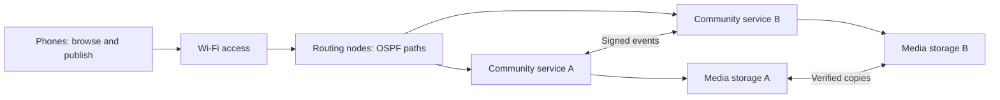

# Kibera Mesh: node roles and local media

Decision note, 4 October 2026; deployment updates through 5 October. Two Nostr relays, two Blossom stores and bounded automatic signed-post catch-up are deployed as optional service experiments. Media replication remains explicit. The operator clarifies that the priority is the ready network foundation for existing applications; further custom application integration is paused. See [network readiness](kibera-mesh-network-readiness.md).

We have sufficient evidence to close the initial connectivity/recovery loop. `20166D605787` matches HTTP 200 from phone `10.21.0.199` at 22:29:43 EAT on the recovered primary portal. Cable failover/failback and independent HP static-page access during original-service-process loss already pass. Move next to useful content and replication, with a single acceptance check per new capability.

## What runs where

| Role | Runs | Current or candidate hardware |
| --- | --- | --- |
| Routing node | LAN addressing, firewall, route exchange, transit links | The two existing MikroTiks, running RouterOS/OSPF |
| Access point | Nearby users' Wi-Fi access | The two UniFi APs |
| Service node | Local application, catalogue, relay, replication worker | Existing computers now; maintained Linux mini-PC/Pi later |
| Storage node | Media objects, checksums, retention and replica inventory | Service host with internal or attached disk/SSD |
| Participant | Browse, publish, download and optionally cache content | Phone, tablet or laptop |

One physical device can perform several roles if its hardware/software supports them. Our existing MikroTiks are assigned to routing; their limited RAM/flash and stock software are not the media-store plan. A service host need not also route traffic. Neighbours communicate through reachable radio/cable links; physical proximity without a compatible connection does not establish reachability. Multi-hop routes connect more distant users. A disconnected group can retain its local content and reconcile changes when paths return.

A phone can hold an identity, publish events, store files and contribute transfers while a suitable app is running. That is distinct from forwarding third-party Wi-Fi traffic as an infrastructure router. Plan the iPhone as a participant/cache, not an always-on relay/storage anchor: ordinary apps can be suspended in the background. [Apple background execution guidance](https://developer.apple.com/documentation/uikit/extending-your-app-s-background-execution-time).

A USB flash drive or SSD alone has no executing processor, server process or network interface. It becomes a node's storage when attached to a powered computer/router that actually supports the service. A Pi is already a computer, so nodes do not have to be full-size PCs.

## Community hardware direction

Use the two current computers to learn the service's CPU, storage, bandwidth and uptime requirements before purchasing a fleet. The candidate deployment unit is a maintained community site: routing/AP equipment plus an always-on service computer, durable storage and backup power. Residents join with their existing phones; each resident does not need to purchase a server.

Raspberry Pi-class systems are a valid option, alongside suitable reused computers and mini-PCs. Compare the complete installed cost, including SSD, power supply, enclosure/cooling, networking and power backup, with locally obtainable alternatives. A Pi's built-in Wi-Fi is not a substitute for an appropriately placed community backhaul/access radio. Raspberry Pi 5 offers Ethernet, USB and an SSD connection path, with power requirements dependent on peripherals; consult [official Pi 5 specifications](https://www.raspberrypi.com/products/raspberry-pi-5/) before choosing a kit. No purchase/model/capacity is approved or prescribed by this note.

## Where media lives

The actual photo/audio/video bytes live on disks attached to participating storage hosts. A catalogue records each object's cryptographic hash, size, media type, ownership/access policy and known replica locations. A URL describes a retrieval location; it is not a durable promise that a copy exists there.

Start with a full verified copy on each of the two lab hosts. For a deployment, propose three maintained copies on independently powered/located hosts for important shared content, plus a separately recoverable backup. This is a design target, not a current guarantee. RAID or multiple disks in one box do not provide independent node availability. Replication of deletions is not a substitute for a recoverable backup.

For full replication, usable content capacity is bounded by the smallest participating allocation. Example: 200 GB of shared content replicated three times consumes about 600 GB in aggregate, before indexes, growth, filesystem overhead and backups. Do not silently copy every member's entire phone gallery. Define consent, per-user quota, retention, visibility and operator responsibility before broad uploads. Private content needs access controls and encryption with a key-recovery policy; a content hash is not encryption.

The phone can retrieve from another replica when one is absent, provided the client knows another reachable location. That needs application/catalogue behaviour beyond OSPF: routing repairs paths, but does not copy files or select replacement service instances.

## Nostr and file storage

Nostr's base protocol provides signed events and client/relay messaging. Local relays can carry posts, identity/profile information and references to media; each relay has its own persistence policy. Publishing to one relay does not automatically populate every other relay. We must select a relay implementation, configure clients to use local relays and implement/test event reconciliation and retention. [NIP-01](https://github.com/nostr-protocol/nips/blob/master/01.md).

For the Nostr direction, prefer evaluating **local Nostr relays plus Blossom media servers**, with hashes and multiple replica locations. Blossom specifies hash-addressed HTTP blobs; its mirroring extension permits requesting a server-side copy. Nostr's current Blossom integration describes finding alternate media-server locations. These are capabilities, not a guarantee of copies: software must request/verify mirroring, maintain free space and honour retention. [Blossom](https://github.com/hzrd149/blossom), [BUD-04 mirroring](https://github.com/hzrd149/blossom/blob/master/buds/04.md), [NIP-B7](https://github.com/nostr-protocol/nips/blob/master/B7.md).

IPFS is an alternative to evaluate for content addressing and peer retrieval. Durable availability still requires deliberate pinning on reachable hosts and enough storage. Local peer discovery must also work across the routed subnets; link-local multicast discovery cannot be assumed to cross the routers. Configure known peer addresses and validate disconnected operation rather than relying on public gateways or bootstrap infrastructure. [IPFS persistence](https://docs.ipfs.tech/concepts/persistence/), [IPFS peer/content discovery](https://docs.ipfs.tech/concepts/how-ipfs-works/).

Update, 5 October: `nostr-rs-relay` 0.10.0 runs on both computers with separate persistent SQLite volumes. Both independently hosted boards use both relays. Initial bounded reconciliation copies the three existing signed posts to the HP without changing signatures or IDs; see [the Nostr lab](kibera-mesh-nostr-lab.md). Reconciliation is explicit and limited to recent lab posts; continuous replication is not implemented. There is no Blossom server or IPFS daemon. The custom media-copy prototype validates its own mechanics, without claiming protocol compliance.

## Completed first build: shared local media

Keep both routers, both transit paths and both current hosts running. The next useful increment is a small media catalogue that can retrieve the same real file from both hosts without external internet.

1. Import one explicitly selected small photo, audio file or PDF into a dedicated media directory, retaining the original untouched.
2. Give it a SHA-256 identity and catalogue entry; expose only the dedicated imported objects, not a computer's folders.
3. Transfer a copy to the HP, verify the hash there and record both reachable locations.
4. Let a phone browse/open it through the local catalogue. One new end-to-end content test is sufficient to pass this increment.
5. Add automatic replication/location selection, then test one media-host interruption once that capability exists. Evaluate Nostr/Blossom integration against this working local content flow.

The initial media increment is complete: two generated WAV samples were copied and hash-verified on the HP, and the operator confirms the new item appears and plays. Media replication remains a manual pull followed by server reload. Independent Nostr relay hosting and bounded signed-event reconciliation now pass, including HP reading/posting while the primary relay is stopped and copying that post back after recovery. Established Blossom storage, continuous replication and durable content policies remain to implement. No hardware purchase is needed for the current two-host lab.
