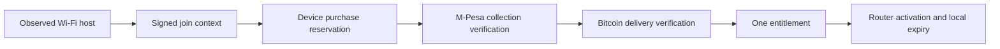

# Mesh device access and abuse controls

Design milestone: 6 October 2026. Mesh owns its catalogue, receipts, device
bindings and gateway controller. WispMan is a reference for operational
questions; it is not a dependency or a source for copied implementation.

Updated 22:23 EAT: the reservation/schema, Bitika/Paystack shared purchase guard,
native activation, trusted Primary TLS and nonce replay protection are deployed.
The current home pass still covers one device. TV sponsorship, family slots,
proof-based transfer and real load acceptance remain unbuilt/unaccepted.
[Current pilot and device-product policy](mesh-pilot-readiness-and-device-plans.md).

## What a customer should experience

Join the open **Mesh** Wi-Fi, see the welcome page, choose an internet pass and
approve the M-Pesa prompt. The verified purchase activates that device
automatically. The customer does not type a router username or password.
Six-digit vouchers remain a separate redemption option.

Free local services remain available without purchasing internet. Selected
internet services can have narrowly scoped exceptions. Buying internet does
not grant access to router management or other customers' devices.

## What the documentation taught us

An authenticated, read-only review covered WispMan's getting-started, clients,
plans, billing, M-Pesa, routers, troubleshooting and FAQ pages. These are
descriptions of intended behavior, not verification of source code or live
security controls. The useful lessons are:

| Observation in the documentation | Mesh design decision |
| --- | --- |
| Hotspot, PPPoE and TV/static services have different provisioning paths | Keep product type and target-device flow explicit; do not treat a TV purchase as the paying phone's pass |
| Plan time limit, validity, speed and shared users are separate fields | Snapshot those limits independently at purchase; preserve the existing prices and 3 Mbps rates |
| TV/static access uses device MACs and binding state | Confirm the intended device on the enrolled router; enforce an expiry and accounting rather than adding an indefinite bypass |
| Payment workers can run concurrently and recover old processing claims | Use durable state and atomic ownership; a worker timeout is not evidence that a payment failed |
| Plan synchronization can restore missing resources | Reconcile only Mesh-owned resources, with revisions and revocation state; never resurrect a revoked entitlement |
| Router examples include a full-permission API user and plain API access | Retain pinned private management access and use the smallest tested permission set; do not copy that configuration |
| Destination-IP rules are used for some free HTTPS services | Review shared-host exposure and ports; destination allowlisting is not proof that only one app can use the connection |

Authenticated references: [plans](https://3westsatenet.wispman.net/index.php?_route=documentation/plans),
[M-Pesa](https://3westsatenet.wispman.net/index.php?_route=documentation/mpesa),
[routers](https://3westsatenet.wispman.net/index.php?_route=documentation/routers),
[troubleshooting](https://3westsatenet.wispman.net/index.php?_route=documentation/troubleshooting).
Raw documentation stays in ignored private evidence files. Mesh does not import
vendor assets, UI, scripts or customer records from this review.

## Separate the records that carry authority

| Record | Purpose and authority |
| --- | --- |
| Join context | Short-lived evidence of a host observed by one enrolled gateway, tied to a browser session |
| Payment attempt | Immutable provider reference, product/price snapshot and payer request; an attempt is not proof of collection |
| Financial receipt | Authenticated collection and Bitcoin-delivery evidence, with exact amount, recipient and reference |
| Entitlement | The purchased limits, original deadline and remaining allowance; a retry cannot create more time or bytes |
| Device binding | Current gateway/device association; MAC is a connection identifier, not proof of ownership |
| Router activation | Application of that entitlement to a verified live host, acknowledged by the enrolled gateway |

The current paid lane waits for verified Bitcoin delivery before issuing
access. Bitika delivers directly to the stored recipient; it must not trigger
another Engine send. Paystack's fallback uses a funded Bitcoin treasury, whose
KES collection, fees and replenishment need separate reconciliation. A Blink
key alone does not convert the incoming bank balance.

## Milestone implemented: one unresolved device purchase

The deployed Bitika and Paystack checkout reserves `(router_id, mac_address)` in
PostgreSQL before initiating collection. A unique device key selects one owner
even if two browser tabs submit different request UUIDs at the same time.
The reservation is checked against the authenticated join context and payment.

- Retrying the same owned purchase returns its existing result without another
  provider request. A crash before the durable send marker can resume the
  unstarted attempt.
- An ambiguous provider response retains the reservation. Age alone does not
  release it. Reconciliation queries the preserved provider reference.
- A definitively ended payment permits a later purchase only when there is no
  unexpired queued, claimed or active allowance for that device.
- Initiated, unresolved payments from before the reservation-table deployment
  also block new references. An empty new table cannot erase earlier exposure.
- A conflicting, unstarted local attempt is closed without cancelling the
  original payment or revealing another browser's receipt identifier.
- Prompt throttling remains independent: changing the UUID or join cookie does
  not reset device/phone limits. Oversized request bodies fail before effects.

This milestone applies to the enrolled **Bitika/Paystack automatic lane**. It is not a
universal lock covering voucher redemption or future top-up.
A simultaneous voucher/payment policy and recovery after losing a browser
session still need implementation. Changing the device MAC is also outside
this reservation's guarantee.

Implementation: [reservation](../../lib/mesh-access/checkout-reservation.ts),
[checkout](../../app/api/payments/route.ts),
[additive schema](../../scripts/mesh/checkout-reservations-schema.sql).
Ten production-guard tests, 38 access tests and 51 payment tests pass using
disposable databases and mocked financial effects. Tests exercise concurrency,
provider uncertainty, old initiated payments, live allowances and retry recovery.
They do not establish multi-host production load capacity.

**Updated release state, 6 October:** the additive schema and application are
deployed on the home lane. The existing installer includes the table
(`npm run mesh:schema`); a missing reservation table prevents a new charge
from proceeding. No prices, active customers or serving-router settings changed.
The latest payment/access/guard suites have 99 passing checks; see the
[current release and production gates](3west-production-readiness.md).

## Binding a device without pretending MAC is identity

The existing local agent uses the connection's socket peer to look up the live
HotSpot host. Customer-supplied MAC, IP and router fields cannot choose the
activation target. The cloud verifies the gateway signature, one-use join
ticket and private browser session. Hidden native router credentials bind one
session to the observed device and preserve the entitlement on retries.

MAC addresses can be spoofed or rotated. Production recovery should require
ownership evidence, close the old binding, and retain the original deadline
and consumed time/bytes. A phone number or a copied MAC alone must not authorize
a transfer. Never send the old receipt or hidden router password merely because
a new browser presents the same MAC. The transfer workflow is not built yet.

TV sponsorship needs a separate flow: the paying phone selects a device
observed on its intended gateway and proves authorization to sponsor it. Use
the Wi-Fi MAC for wireless TVs, Ethernet MAC for wired TVs. Restrict attempts
and transfers, audit them, and keep the resulting allowance device-bound.

One concurrent session limits credential reuse. It does not prevent a customer
from tethering a phone, sharing content, spoofing a MAC or exhausting airtime.
Control bandwidth and concurrency and investigate anomalies; do not promise
perfect prevention of sharing on consumer devices.

## Enforcement and recovery requirements

1. **Gateway trust:** enroll the serving router with its own verified identity,
   keys and allowed interfaces. Private management, scoped controller access
   and browser HTTPS are separate controls. Primary's trusted TLS is active;
   each field enrollment needs its own verified production handoff.
2. **Router authority:** expiry must work without the cloud or a signed-in
   Windows user. Preserve counters on reconnect and controller retries. Check
   startup, router clock, power recovery and fail-closed expiry. Reconciliation
   must not overwrite unrelated router configuration.
3. **Packet paths:** inspect guest IPv6, FastTrack/offload, queues, client
   isolation and management separation on the actual serving equipment. An
   IPv4 captive page is not proof that every other packet path is controlled.
4. **Free services:** define exact destination/protocol/port rules, review shared
   IP/CDN exposure, and monitor changes. Prefer local apps for offline service.
   General HTTPS exceptions cannot guarantee prevention of tunnels or VPNs.
5. **Payments:** authenticated callbacks, immutable references and atomic
   settlement/grant records prevent replay from creating another allowance.
   Keep unresolved collections visible to an operator. Recovery must query,
   not blindly charge or send Bitcoin again.
6. **Operations:** record activation, revocation, device transfer, settlement and
   configuration revision with an actor. Keep customer identifiers and secrets
   out of public logs. Monitor stale heartbeats, unresolved payments and router
   resource pressure; avoid applying large-router tuning to 128 MB hardware.

## Next production milestone

Complete catalogue semantics before enabling the existing service: 80 usable
minutes within one day must remain different from an 80-minute wall-clock
deadline. Confirm when validity starts and how calendar months are calculated.
The documentation review does not resolve those exact current-plan settings.

Then stage the same prices, symmetric 3 Mbps and separate TV products on a spare
router or isolated SSID. Test one operator purchase, automatic activation,
unpaid-device denial, browser-close recovery, reconnect and correct expiry.
Preserve existing customer balances before any cutover. The serving-router
inventory and entitlement mapping remain prerequisites; see the
[production review](3west-production-readiness.md).
