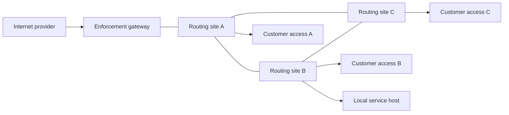

# Mesh production operations: home pilot to field deployment

Prepared 6 October 2026, Africa/Nairobi. This guide covers the network, paid
internet, free application access and operating responsibilities. It is an
independent Mesh design, not a WispMan clone. The dated
[production review](3west-production-readiness.md) records release evidence and
blocking gaps; older lab documents retain historical checkpoints.

Latest owner checkpoint, 22:23 EAT:
[pilot decision, security/stress evidence and TV/family products](mesh-pilot-readiness-and-device-plans.md).
That document records the current live checks and planned capacity milestone.

**Decision today: proceed with home commissioning; do not replace the existing
3WEST paying-customer service yet.** Connectivity and one actual payment-to-
Bitcoin-to-internet flow have acceptance. That proves the model at lab scale,
not production security, 3WEST product parity or capacity. Each milestone below
has one bounded test set. Repeating page codes, media demonstrations or old
manual-login experiments is unnecessary.

## What the customer buys and what remains free

1. Join the open **Mesh** SSID. The local welcome page introduces Mesh, its
   Bitcoin identity and the internet-purchase option.
2. Choose a pass, enter the M-Pesa number and approve the prompt on the phone.
   Never enter the M-Pesa PIN in Mesh. Waiting, verification and connecting
   are distinct customer states.
3. Mesh verifies the provider receipt and Bitcoin delivery, then activates the
   observed device automatically. Customers receive no router login credentials.
   A six-digit voucher is an alternative redemption path.
4. Purchased general internet ends at its actual limits. Approved free services
   remain available afterwards. A successful receipt alone is not an active
   router session; the UI must wait for the gateway acknowledgment.

Bitika is the current preferred path and delivers Bitcoin directly after KES
collection. Paystack's fallback pays Bitcoin from a funded treasury; its bank
settlement does not replenish that treasury. Fees, KES balances, BTC deliveries
and fallback liquidity need separate accounting. A Bitika receipt must not
cause another Engine send. See [Bitika operations](mesh-bitika-primary.md) and
[fallback settlement](mesh-engine-bitcoin-settlement.md).

| Service | WAN needed? | Current evidence and customer promise |
| --- | --- | --- |
| Router-hosted welcome and local assets | No | Open entry and automatic captive appearance accepted on the lab iPhone |
| Buying internet / live M-Pesa collection | Yes, plus Mesh cloud and the selected provider; Engine for Paystack only | KES 10 Bitika delivery and recovered access accepted; revised captive completion still needs acceptance; no offline payment promise |
| General paid internet | Yes | Automatic activation and router-local deadline demonstrated; retained allowance and recovery must be commissioned on each gateway |
| Signal text exception | Yes | Unpaid bidirectional foreground text accepted on Primary, with ordinary browsing blocked; registration, calls, media and notifications are not covered by that acceptance |
| Blink | Yes | Signed-in foreground refresh accepted; registration, installation, every feature and locked-screen notifications are not established by that result |
| Jami local communication | No for the tested local path | Foreground text and calls accepted with WAN/cellular absent on protected lab Wi-Fi; screen-off reception failed on both phones |
| Local Nostr/media experiments | No when their hosts and routes are running | Optional service demonstrations, not requirements for the captive or paid internet |

The welcome popup is a short onboarding and payment interface. Communication
apps run outside it. Full Safari/Chrome and native-app results must be tested
separately from the captive mini-browser.

## Persistent purchase access for unpaid customers

Keep a **router-hosted Mesh portal** reachable by every connected customer,
including unpaid users and after their pass expires. On the current lab gateway,
`http://10.30.0.1/mesh.html` is the permanent entry; `/login` remains the welcome
page. The permanent page has a visible purchase action and a plain address to
reopen/bookmark in a full browser. This page and
its local assets survive WAN loss while the router/AP are powered; live checkout
requires WAN, the cloud service and payment/settlement readiness. The page must
explain an outage rather than start a collection it cannot complete.

The operating system controls when its captive popup appears or closes. Mesh
can offer a permanent local page and report unpaid/expired captivity through
properly commissioned CAPPORT and reconnection detection; it cannot force an
indefinitely open window, overlay its purchase screen inside another app or
redirect arbitrary encrypted pages safely. Do not intercept TLS or forge an
external site's successful response to keep a popup visible.

Free-app exceptions must not accidentally make the OS's general-internet check
appear successful for an unpaid customer. Keep status truthful: selected free
services work, general internet is restricted, and a pass remains available.
Commission CAPPORT with its trusted HTTPS status API and DHCP advertisement;
local JSON files alone do not establish those controls. Reopening the local
portal remains the fallback, without promising repeated OS popups.
[Apple captive-network guidance](https://developer.apple.com/news/?id=q78sq5rv),
[Android portal detection and API support](https://developer.android.com/about/versions/11/features/captive-portal).

Acceptance: dismiss the welcome window while unpaid, reopen the local purchase
entry, use the approved app without receiving general internet, reconnect, and
open the page again after expiry and during WAN loss. The portal change is in
installed on the pinned home router: four assets were uploaded and read back
byte-for-byte, with previous files backed up and firewall/DHCP/site configuration
preserved. Local browser checks pass; physical-phone acceptance is pending.

## Equipment roles and minimum requirements

Residents use their existing phones. Every resident does not need a Raspberry
Pi, computer or routing node. Maintain routing and service equipment at selected
community sites. An SSD or flash drive supplies storage to a powered host; it
cannot route, execute a server or become a node by itself.

| Role | Required capabilities | Purchase and commissioning rule |
| --- | --- | --- |
| Customer AP | Managed guest VLAN/SSID, client isolation, controlled management access and supported firmware | Its radio provides user access. Verify isolation across bands and across APs; an SSID name alone is not isolation. Match PoE voltage, standard, current and cable budget before connection. |
| Routing site | IPv4 routing, compatible OSPF or an explicitly configured alternative, VLAN/firewall support, unique addressing, secure management, configuration backup and adequate measured forwarding capacity | A consumer router may be an AP only. It is not automatically a routed Mesh peer. Software support and port/radio roles must be checked before purchase. |
| Internet enforcement gateway | Tested RouterOS HotSpot, per-device accounting/limits, private signed-agent management path, local expiry, guest isolation and correct queue/firewall packet path | Stock replacements must use the commissioned controller interface. Another vendor needs a new tested adapter; not every router supporting OSPF can enforce these passes. |
| Backhaul link | Reachable compatible endpoints, sufficient measured goodput, correct RF/cable placement and lawful site/radio settings | Prefer cable where practical. For outdoor wireless, design a dedicated backhaul; a client AP or household repeater is not a capacity guarantee. |
| Service/controller host | Always-on OS with supported runtime, wired access, secure secret storage, monitoring, reliable clock, persistent disk and startup without interactive login | Existing computers suffice for home tests. Choose a maintained mini-PC/Pi/server from measured workload; add SSD and backup power for field duty. |
| Power/site | Correct supplies, protected cabling/enclosure, independent recovery access and defined site custodian | Radio reach without reliable power does not deliver availability. Budget UPS/runtime separately for router, AP and host. |

For **new shared backhaul/gateway purchases**, make Gigabit Ethernet a minimum
procurement target when carrying a subscription of 100 Mbps or more. Prefer
current supported hardware and a separate access/backhaul arrangement. RAM and
CPU numbers alone cannot certify capacity: run the intended HotSpot, firewall,
queues and encryption together under load. Set the client count from those
results, not a product's wireless PHY rate or routing-only benchmark.

The existing RB951Ui-2HnD has five 10/100 ports, a 600 MHz CPU and 128 MB RAM.
It remains useful for a small pilot, but a single Ethernet path cannot carry
more than its link rate; usable payload throughput is lower. Do not interpret a
faster home subscription as equivalent guest throughput.
[Official hardware specification](https://mikrotik.com/product/RB951Ui-2HnD).
The MIPSBE router hosts static captive files, not this Next.js application or
payment database. [RouterOS container architectures](https://help.mikrotik.com/docs/spaces/ROS/pages/84901929/Container).

## How additional sites join

The present lab has two routed sites, each with a client subnet and AP. OSPF
uses an Ethernet transit and a protected radio transit, preferring Ethernet.
Link failure/failback passed. This is not an 802.11s deployment or proof of
arbitrary radio-peer discovery. Two links between the same two routers cannot
route around either router's loss. See [network evidence](kibera-mesh-network-readiness.md).

This is a proposed three-site topology, not deployed evidence. The third path
permits an intermediate-router failure test. OSPF selects available IP paths;
it does not replicate media, create internet bandwidth, transfer paid sessions
between gateways or provide app discovery across subnets.

Enroll each site through a registry containing its unique ID, management
identity/key, client/transit prefixes, VLAN/interface roles, routing peers,
controller ownership, AP/radio settings and configuration revision. Guest
interfaces must not form routing adjacencies. Authenticate authorized transit
peers and accept only assigned prefixes/default origins. Select authentication
supported by the deployed software, then test unauthorized-peer rejection.
[RouterOS OSPF interface controls](https://manual.mikrotik.com/docs/cli-reference/routing/ospf/interface-template/).

There are two different expansion patterns:

| Pattern | Consequence |
| --- | --- |
| More APs in one intentionally designed guest access domain | One enforcement gateway can own purchases. VLAN transport, broadcast size, isolation and MAC visibility must be validated end to end. Routed links do not automatically transport that guest VLAN. |
| Separate routed customer sites with their own enforcement gateways | Each gateway must enroll, issue its own signed observations and claim only its own jobs/orders. Define pass portability and roaming before selling a network-wide pass. No transfer may restart time or duplicate allowances. |

The current automatic lane is enrolled specifically for **KM-LAB-001** and its
customer network. Node2 transports lab traffic but does not establish a second
automatic paid-customer gateway. Do not copy the lab key, serial, subnets or
global queue credentials onto additional routers. The older generic gateway
job path and free-app administration also need per-router ownership before
being used as a distributed rollout controller.

Do not launch the older `gateway-agent/index.ts` as the production paid-access
controller: its generic grant job creates a HotSpot `bypassed` binding and depends
on later cloud revocation. That is not the native signed lane's local deadline
guarantee. Its shared job queue and hostname-only whitelist sync are also not
the scoped Signal trial installer. These paths require replacement or explicit
deprecation before an operator can treat the admin whitelist as a production
policy publisher.

The deployed hardening patch rejects legacy job claims with HTTP 409 while
automatic Mesh access is enabled. This is defense against starting the wrong
controller; it does not clean up already-claimed legacy jobs. Inventory existing
workers/bindings before a field release.

## Capacity and failure domains

Adding APs increases coverage and possible concurrent demand. It does not
increase upstream internet capacity. Model each site against its narrowest
gateway, backhaul, radio-airtime and ISP constraint. A 100 Mbps nominal shared
uplink divided by 3 Mbps caps is not a promise that 33 customers will sustain
full speed: overhead, contention, demand mix and control traffic reduce room.
Measure the aggregate with the actual policy enabled.

Use a local throughput server to separate backhaul performance from ISP tests.
Measure both directions and latency/loss while simultaneous clients saturate
the link. Record router CPU/memory, connection count, queues, AP airtime and
retransmissions. Test the radio backup as well as the preferred cable. There
is no universal fixed throughput reduction per wireless hop; shared airtime
and radio topology determine the result.

Before admitting more clients, retain operational headroom on the busiest link
and router. A sustained CPU above 80%, increasing queue delay/loss, or repeated
DHCP/connection-table pressure is a proposed alert threshold, not a manufacturer
capacity guarantee. Configure customer count and site admission from the
accepted measurements. Monitor goodput and customer experience, not just CPU.

| Loss | Required behavior / known limitation |
| --- | --- |
| WAN | Local routes/services continue; external apps and new cloud purchases report unavailable. Existing internet has no working upstream. |
| Cloud or settlement service | Do not start a charge without readiness. Retain unresolved receipts; already activated access continues only within its local limits. |
| Controller host | Existing expiry/accounting must remain safe locally. New activation pauses; no blanket bypass is added. Restart recovers original orders without new money movement. |
| One backhaul | Select a tested alternative, or clearly isolate the affected site. Sessions may be interrupted; measure restoration. |
| Intermediate router | Requires a genuinely independent third path; the two-router lab cannot prove this yet. |
| One local service host | Routing alone cannot replace it. Replica discovery, storage consistency and local push endpoints need their own service design. |
| Power loss/reboot | Dedicated cloud controller reboot recovery has lab evidence. Target router/AP power recovery, clock sanity and preserved deadlines/counters must still be demonstrated in the field. |

An additional internet gateway introduces NAT/session and billing choices.
Simple OSPF default-route failover does not migrate connection state or entitle
the customer twice. Define gateway ownership and failover before introducing
multiple providers.

## Cybersecurity commissioning

Use [device access and abuse controls](mesh-device-access-security.md) as the
implementation reference. Treat every unmanaged customer device as untrusted.

| Boundary | Required field control and proof |
| --- | --- |
| Guest versus management | Separate VLANs/interfaces; deny router/AP/controller/server administration, private destination abuse and peer-to-peer access except intentionally published services. Test unpaid and paid devices, wired ingress and both Wi-Fi bands. |
| Open Wi-Fi handoff | Trusted TLS for production browser tickets and application services. A valid signature does not conceal an HTTP bearer secret. Do not solicit wallet recovery phrases or sensitive account credentials in the popup. |
| Gateway/controller | Per-site keys and pinned identity, narrow private management access, smallest tested permissions, signed requests with replay controls and revocable enrollment. Keep secrets off router-served HTML and public Git history. |
| Packet paths | Guest IPv6 is denied until equally authorized/accounted; inspect FastTrack and hardware-offload paths. Queue and HotSpot rules must cover every authorized path. |
| Payment and vouchers | Provider verification, immutable price/reference, atomic device reservation and settlement/grant ownership; bounded bodies and durable throttles. An unknown charge/send outcome is reconciled using its original reference. |
| Binding/recovery | MAC is not cryptographic identity. Require proof to transfer a pass; close the old binding and preserve consumed allowance and expiry. Test private-MAC rotation and DHCP address changes. |
| Operations | Audit access changes and transfers, redact secrets/identifiers, back up DB/config, test restore, patch supported releases and alert on unresolved collections or missed activation. |

FastTrack can bypass HotSpot/queue processing; IPv4 HotSpot is not equivalent
IPv6 enforcement. These are commissioning checks on the target router, not
optional UI work. [Packet flow](https://help.mikrotik.com/docs/spaces/ROS/pages/328227/Packet+Flow+in+RouterOS),
[HotSpot reference](https://help.mikrotik.com/docs/spaces/ROS/pages/56459266/HotSpot+-+Captive+portal).

For the small pilot, use a **Fixed** private Wi-Fi address for the Mesh SSID,
without asking people to disable privacy globally. This is a documented pilot
condition, not a substitute for a production transfer/recovery flow. One
simultaneous session and speed limits discourage casual sharing; neither
prevents MAC spoofing or downstream tethering perfectly.

## Free-app policy is a maintained product

An exception needs a named owner and a revision containing router/customer
scope, exact hostname, protocol/port, purpose, feature scope, approval date,
expiry/review date, observed DNS/CNAME behavior and rollback markers. Display
**verified free**, **pilot**, or **needs internet** honestly in the directory.
Do not equate an admin whitelist checkbox with packet-path acceptance.

For each new app, begin with installed, authenticated clients. Observe only
necessary destination metadata; do not intercept wallet TLS, PINs or message
contents. Add the narrowest rule set, then test the desired feature on an
unpaid phone and an unrelated destination that must stay blocked. Repeat on
each enforcement gateway after deployment. Test DNS changes and remove stale
entries without broadening to a whole cloud provider or app store.

Shared CDN/IP hosting can permit unrelated HTTPS traffic at the same address.
IP rules cannot certify strict app identity or prevent every tunnel. Platform
push, app installation, registration, voice/media and wallet payment callbacks
are separate dependencies and acceptance scopes. Keep general UDP/QUIC denied
unless a reviewed feature requires it. Guest rules must still deny management.

First retain the accepted Signal **text** scope; then commission Blink's
installed-wallet balance/receive scope separately. A real wallet payment is a
separate approved money movement, not a prerequisite for a no-money reachability
test. See [Signal acceptance](mesh-signal-text-trial.md) and
[Blink dependency plan](blink-free-app-pilot.md).

## Communication independent of the internet

Jami's local DHT/bootstrap configuration proved foreground texts and calls.
This is a valid local-network service demonstration. It has not proved an
always-reachable consumer messenger: both phones stopped receiving with their
screens off, and open guest access requires its own deliberate local-service
exception. Ordinary client isolation must not be disabled wholesale to make
communications work.

For Android, test battery/background policy with the selected app and OS. For
iPhone, Apple supports Local Push Connectivity, but the installed app must
integrate the extension and obtain the granted entitlement. Router settings
cannot add this to stock Jami. Mac/Xcode, a Developer team and an entitled
signed build are prerequisites for the offline locked-screen proof.
[Background delivery plan](mesh-background-delivery-options.md),
[Apple Local Push Connectivity](https://developer.apple.com/documentation/networkextension/local-push-connectivity).

Choose an open protocol/client only after testing the real requirement:
Android-to-iPhone text and incoming call while locked, WAN/cellular absent,
across routing sites, then after service-host restart. A branded fork adds
license, app signing, update and security-maintenance work; familiar existing
apps are preferable while they satisfy the required journey. This work can
continue independently of paid-internet commissioning.

## Home milestones and acceptance record

Run these in order, stopping on a failed milestone. Keep one operator device,
one unpaid comparison device, cellular off, and a verified recovery connection.
Store private evidence with timestamps, software/config revision, gateway,
device/session identifiers and result. Do not publish payment secrets or raw
customer exports.

| Milestone | Bounded acceptance | Current status |
| --- | --- | --- |
| 1. Release and catalogue | Additive schemas before checkout code; health/readonly readiness; deployed version identified. Stage 3 Mbps plans without changing old immutable orders. Resolve uptime/validity start and calendar-month rules. | Checkout reservation schema installed on the configured database during production preparation; application release verification is still required. Catalogue semantics remain blocking for parity. |
| 2. Isolation | Unpaid and paid phone cannot reach router/AP/admin or another customer; deliberate service exceptions work; alternate IPv6/FastTrack/QUIC paths cannot bypass the gate. | Rules exist on lab; full physical acceptance pending. |
| 3. One real purchase | Operator ready for one existing-price KES 10 M-Pesa prompt; collection/BTC/activation receipt agree. Customer receives automatic internet with no router credentials. Unpaid peer still blocked. | Prior 50 Mbps lab purchase accepted; final-policy 3 Mbps flow and completion UX need acceptance. |
| 4. Recovery and expiry | Close captive/browser during processing; preserve original reference and one collection. Reconnect/change DHCP IP; original limits remain. Idle/connected expiry cuts public access while free scope remains. | Partial lab evidence; production recovery/transfer and correct source-plan semantics remain open. |
| 5. Free apps | Unpaid Signal text both ways and external browsing denied; one selected Blink feature evaluated independently. | Signal text accepted on Primary; broader features/Blink pending. |
| 6. Unattended outage | Controller and router power/reboot/clock tests; no interactive sign-in; existing limits remain, unresolved payments reconcile once, WAN loss preserves local service. | WAN route withdrawal/recovery accepted on protected lab; controller cold-start and guest-specific recovery pending. |
| 7. Load and expansion | Measure expected simultaneous clients with paid/free policy active. Add third routed site and independent path; verify peer rejection, job ownership and intermediate-router reroute. | No production load or third-router acceptance yet. |

A fake/no-sale voucher may test transport/activation without payment. It cannot
substitute for the one real checkout milestone. A mocked test suite cannot
certify Wi-Fi isolation or router packet-path enforcement.

Run `npm run mesh:preflight` for a read-only, signed readiness check of configured
enrollment, live database/heartbeat and Engine readiness. A
`ready_for_home_test` result supports a bounded home test decision; field blockers
remain explicit and make the full preflight exit nonzero. It is not a command
to buy a pass, send Bitcoin, change prices or import router configuration.

At this preparation checkpoint, the reservation schema is installed, **74 local
tests pass** (10 production guards, 29 access, 35 payments), Next.js **16.3.8**
passes build/typecheck, and `npm audit --omit=dev` reports **0 known production
dependency findings**. Development tooling retains nine findings (five high in
the braces dependency chain and four moderate in legacy esbuild tooling);
these are tracked rather than hidden with a forced incompatible update. The
application patch is not yet verified live: the available Vercel account lacks
the owning project's access. A working public browser check of the previous
release does not verify these local changes.

## Matching 3WEST without changing customer terms

Preserve all nine hotspot prices: **KES 10 / 15 / 20 / 30 / 55 / 85 / 140 /
230 / 450**, symmetric **3 Mbps**, no data cap, FUP off. The first four have
separate usable-time and one-day validity terms; longer products have their
published multi-day/month validity. Preserve the six TV prices **KES 30 / 55 /
85 / 140 / 230 / 450** with their separate sponsorship/device path. Exact
terms and the parity manifest are in the [production review](3west-production-readiness.md).

Current live lab products have 50 Mbps caps and an elapsed-duration model. They
are not yet a faithful migration of these policies. Obtain operator confirmation
or a source export for clock/month semantics rather than inventing them. A TV
purchase must target its observed Wi-Fi or wired MAC appropriately; it must not
activate the paying phone or add an indefinite bypass.

## Field release decision and rollback

Field **go** requires all of the following signed off by the operator:

- Home milestones 1–6 pass for the intended feature scope; measured capacity
  supports the proposed first site. Expansion claims require milestone 7.
- Serving-router read-only inventory, verified identity/management access,
  encrypted backup and an actually exercised local recovery path.
- Current customers' exact remaining time/data, expiry, device binding, speed
  and financial references mapped. No import grants fresh time automatically.
- TLS handoff, isolation, recovery and unattended controller startup complete;
  no unresolved critical payment or permission defect.
- Patched application/runtime dependencies verified in the deployed release,
  with dependency audit and build evidence. Local fixes are not a live-server
  security attestation.
- Provider, treasury, gateway and administrator credentials previously shared
  during the lab rotated or replaced through a coordinated, verified rollout;
  separate keys/scopes, secret owners and revocation procedures recorded. Do not
  revoke a currently required key without installing and verifying its replacement.
- One billing owner per serving HotSpot, defined alert recipient/site custodian,
  treasury balance and replenishment/accounting routine, support/refund process.
- Separate test SSID/VLAN or spare router pilot before editing the current
  paying-customer captive. Deployment and rollback versions are recorded.

Start field use with one site and new purchases. Leave existing allowances
under their original owner until expiry, or migrate only their exact remaining
values after audit. Never run two controllers issuing conflicting allowances
for the same service. Do not import the old wholesale hotspot script into a
serving router without reviewed identity/interface guards.

Rollback removes only Mesh-owned overlay rules/assets/enrollment and restores
the saved serving configuration. Preserve real collection/Bitcoin receipts,
revocations and remaining limits; rolling back software must not send funds
again or revive expired access. Test a scoped rollback on the spare environment
before touching paying customers.

## Operating cadence

Daily: inspect fresh gateway heartbeat, failed/stalled activations, unresolved
collections and settlement states, treasury funds, provider fees, guest packet
denies and link/router load. A collected-but-unactivated customer is a support
case requiring reconciliation, not an instruction to pay again.

On every configuration/app release: record the revision, test one unpaid and
one paid path, retain previous assets and rerun scoped negative tests. On every
new site: enroll a new identity, validate radio/channel/power/link capacity,
confirm the owner of its customer service and exercise one recovery path.

Periodically: restore backups into an isolated environment, review operator
permissions and free-app dependencies, rotate/revoke exposed credentials through
a coordinated rollout, and verify disk/power headroom. Secrets shared during
the lab session must not become long-lived production credentials.

There is no field go-ahead until the blocking gates have actual evidence. The
next useful progress is the final-policy home purchase and security/recovery
commissioning, followed by a small field pilot; new media features are not on
that critical path.
